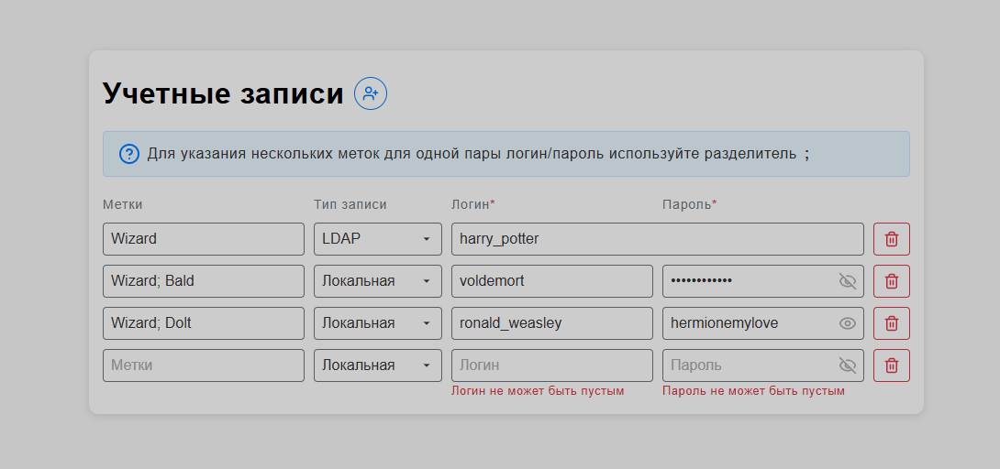

# Форма управления учетными записями

## Описание

Необходимо реализовать форму управления учетными записями. Цель задания — создать веб-приложение, в котором можно добавлять, редактировать и удалять учетные записи.



---

## Функциональные требования

### Форма управления учетными записями включает:

- **Заголовок** и кнопку добавления учетной записи.
- **Подсказки** для поля "Метка".
- **Список учетных записей** с отображением следующих полей:

  - **Метка**

    - _Необязательное поле_ (максимум 50 символов).
    - Вводите текстовые метки через символ `;`.
    - При сохранении поле "Метка" преобразуется в массив объектов вида:
      ```js
      [{ text: "метка1" }, { text: "метка2" }];
      ```

  - **Тип записи**

    - Выпадающий список с заранее предопределёнными вариантами:
      - **LDAP** — при выборе этого типа поле "Пароль" скрывается и сохраняется как `null`.
      - **Локальная** — при выборе этого типа поле "Пароль" показывается и сохраняется как введённое значение.

  - **Логин**

    - Обязательное поле (максимум 100 символов).

  - **Пароль**

    - Обязательное поле, отображается только для типа "Локальная" (максимум 100 символов).

  - **Кнопка удаления** учетной записи.

### Логика работы формы:

- **Добавление учетной записи:**  
  При нажатии кнопки "+" в конец списка добавляется новая пустая запись, состоящая из полей: Метка, Тип записи, Логин и Пароль.

- **Удаление учетной записи:**  
  При нажатии кнопки удаления выбранная запись полностью удаляется.

- **Валидация:**  
  По окончании ввода (например, при потере фокуса для текстовых полей или изменении значения для селекта) происходит валидация:

  - Если обязательные поля заполнены корректно — данные сохраняются/обновляются.
  - Если есть ошибки — соответствующие поля подсвечиваются красной обводкой.

- **Преобразование поля "Метка":**  
  Значение поля "Метка" преобразуется в массив объектов, где каждый элемент имеет вид:

  ```js
  {
    text: "значение метки";
  }
  ```

- **Сохранение данных:**  
  Все данные, кроме поля "Метка", сохраняются в виде текста. Сохранение осуществляется через стейт менеджер (Pinia). При обновлении страницы ранее сохранённые учетные записи должны автоматически отображаться.
